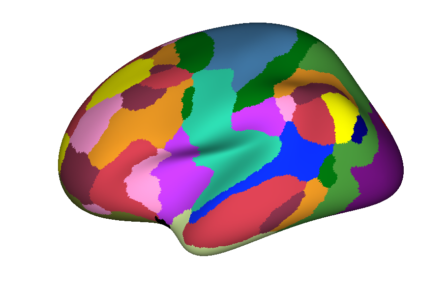
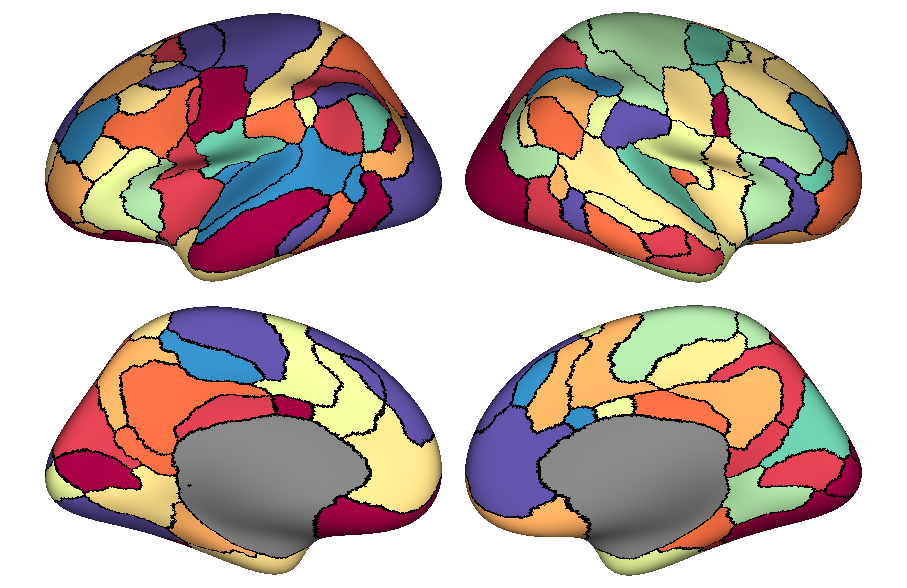

## plotFSurf2
simple(r) surface viz for neuroimaging

These tools are for plotting your data on a FreeSurfer surface. With these scripts, we can plot on any FreeSurfer surface with any parcellation on that surface (.annot file). These tools are meant to be quite simple, so as to be easily-editable. The surface visualization uses MATLAB's [patch](https://www.mathworks.com/help/matlab/ref/patch.html) function. For plotting colors, these tools utilize the direct mapping approach, where the value submitted to visualization function is an index of the colormap. This allows for better handling of multi-color/colormap situations (i.e. borders + roi vals). 

Take a look at the ``example_plot_annot.m`` and ``example_plot_wei.m`` for a quick plotting recipe using the example data provided!

These scripts were adapted from code provided by [Makoto Fukushima](https://sites.google.com/site/mfukushimaweb/home). This project is built off of previously made [surface visualization tools](https://github.com/faskowit/plotFSurf). This second attempt seems to be much better...I hope. Feel free to comment via issue or pull request!

``example_plot_annot.m`` output: 

``example_plot_wei.m`` output:

 This material is based upon work supported by the National Science Foundation Graduate Research Fellowship under Grant No. 1342962. Any opinion, findings, and conclusions or recommendations expressed in this material are those of the authors(s) and do not necessarily reflect the views of the National Science Foundation. 
